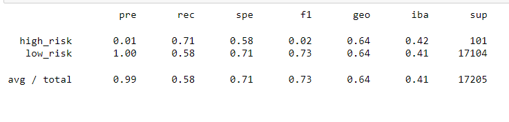
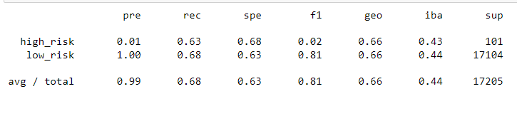
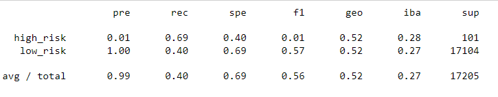
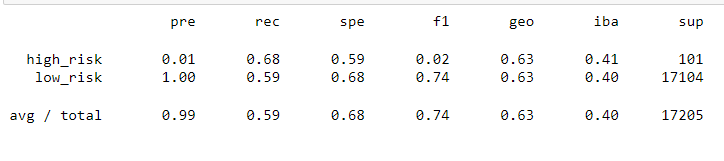
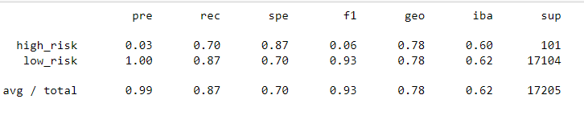
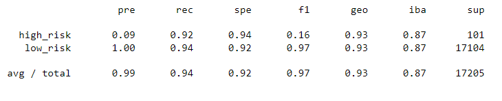

# Credit_Risk_Analysis

## Overview of Analysis

-We were tasked to come up with a machine learning programs to analyze credit risk for 
-our LendingClub peer to peer lending services to see if we could predict credit risk.

## Results

### Naive Random Sampling

- Our first use of our machine learning was Naive random sampling and what was our 
- biggest issue after reviewing our data was that we had an accuracy score of 64.6%
- which most likely wouldn't give us enough accuracy to really use this model.

### SMOTE Oversampling

- Our next model was SMOTE oversampling and again our issue was our balanced accuracy
- score was at 65.8% which again makes using this model very risky.  And we are trying
- mitigate risk for our company.

### Undersampling

- The next model we used was undersampling and just by the defintion it leads us to 
- believe that we might not have the best outcome.  And just like the name says our
- balance accuracy was down to 54.4% which would tell us to move on and look for another
- possible model to assist us.

### Combination Over/Under Sampling

- This new model we had some extra hope due to the nature of it using more way to 
- review our data.  It used the SMOTEENN algorithm but again our balanced accuracy 
- was far below expectations at 63.6%. 

### Balanced Random Forest Classifier 

- Next on our list of models is Balanced Random Forest and this one did improve 
- our balanced accuaracy score to 78.8% which was our best overall score.  This
- was good news but we were hoping for a bit higher of a score to mitigate our
- credit risk as much as possible.

### Easy Ensemble AdaBoost Classifier

- The last model we tried was the AdaBooster and this one gave us a balanced
- accuracy score of 93.1%!  With this accuracy we are very confident that
- we'll be able to mitigate as much credit risk as we can with this learning
- model.

##Conclusion 

- OUr last model was obviously our best model we had and would help our company
- mitigate as much risk as possible compared to our other models.  As a credit
- company it is our goal to lend money in hopes of getting that money back and
- with this model we have a great way to review credit from indiviuals.  Mitigating
- Risk is key for us here and we are happy to use this program.
